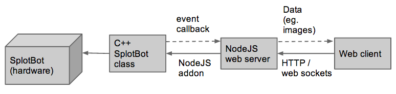

#Architecture
The architecture of the robotic platform must support the goals and requirements
concerning modularity (the goals of programmabaility and usability are not as
directly related to the architecture). The difficulty of designing the
architecture lies in close relationship between the hardware and the software.
Each hardware component must be controlled by the software, so the software needs
to be aware of the hardware, which results in a close coupling between the
software and hardware.

In this section we will outline the architecture chosen and implemented in our
version of the SplotBot robot, including the hardware, the software for
controlling the hardware, and the user interface. Afterwards we discuss to what
extend we have experienced the architecture as being suitable for the robotic
platform, and to what extend the architecture could be improved based on our
experiences.

##The overall architecture
The architecture is outlined in figure \ref{fig:architecture_overview} showing
the interaction between the four main parts of the robotic platform. The
architecture is layered (the bottom layer is to the left in the figure); the first
two parts cover the hardware itself and the controlling of it, and the next two
parts are an attempt to create an environment in which the user interface can be
built.

- The first part of the architecture is the hardware; the hardware basis is the
  frame on which the rest of the components are mounted. Each hardware component
  is then considered an individual module in the architecture; these component
  are hierarchically defined so a module can be built of other modules (e.g. the
  module defining the x/y-axes can consist of multiple stepper motors). These
  modules are defined in a configuration file, a simple text file in JSON
  format.
- The next layer is the software controlling the hardware. The is initialized
  from the configuration file defining the hardware, creating the coupling
  between the software and the hardware. This allows for modularity to the
  extend that modules can be added and removed requiring only that the
  configuration file is updated accordingly and the robot rebooted. This layer
  also include the logging of experiment data. This layer communicates only with
  the below layer (the hardware) through GPIO manipulation.
- The basis for the user interface is a web server; this is a thin wrapper on
  top of the below layer controlling the hardware, allowing for a simple way to
  interact with the robot. This layer communicates both with the below layer
  through function calls and with the above layer through distribution of events
  such as a certain property of the droplet detected by the camera.
- The top layer is the graphical user interface itself, interacting only with
  the below web server. In this layer, the configuration file used for
  initializing the software layer controlling the hardware is also loaded. Based
  on this file the graphical user interface is built, continuing the coupling
  between the hardware and the software to also include the graphical user
  interface, as an attempt to support the goals of modularity. This layer
  interacts with the below layer by sending instructions to the robot and
  through receiving events transmitted by the below layer.

##The choice of architecture
The decision of implementing a layered architecture is based on the whish for a
clear distinction between the hardware (and controlling of the hardware) and the
user interface; the bottom two layers are considered the core of the robot.
These contain all the logic for controlling the robot, including its
programmability. The layered architecture includes support for many different
user interfaces without modifying the core layers of the robot, as long as these
depend only on the interface already made available by the core. The
architecture has the additional advantages of allowing us (a group of three
software developers) working on separate modules simultaneously, giving a
natural way of splitting the tasks to be done [@sommerville2011, pp. 157-158].

//TODO what other architectures have we considered?

##Issues and improvements
//TODO discuss the issues we have found with the architecture, how it has been
improved, and what further improvements could be done
