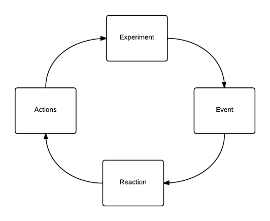

# Autonomous interaction with experiments
\label{sec:experiment_interaction}
 The EvoBot should not only be able to run experiments, it is also made to be
 capable of running autonomous experiments, that is to say that the experiments
 will be start by a human but will be completely self sustained and be capable
 to actively react to changes happening in the observed system. This chapter
 looks at the implementation of the system that allows a user to define an
 experiment and how this system allows for having autonomous experiments.

 We first introduce the goals of the experiment running system. We then look at
 each part of the system discussing how it has tried to achieve the goals and
 the result of the approach including a discussion of possible improvements and
 alternative solutions.

##Goals
The idea behind an autonomous experiment is to define a experiment executing
that loops and continuously adjusts overtime. This is illustrated in figure
\ref{fig:reactive_loop}. The loop begins with the initial actions that will be
executed setting up the experiment for example picking up liquid and putting in
into a petri dish. After the initial actions the experiment will be running,
events with data such as droplet movement will be detected by components. Based
on events in the system the robot will then react doing new actions which will
change the experiment. This loop will create and autonomous reactive feedback
process that will running do actions to change the outcome of the experiment
based on data gatherer throughout the experiment.



Making a user capable of defining autonomous experiments in this system requires
a few capabilities added to the robot, making these capabilities available will
be the goals of this chapter

1. Being able to send instructions to components to perform actions
2. Components should be able to communicate events with data in their executing
   and in the observed experiment.
3. Being able to program the experiment and get it executed on EvoBot. In which
   it should be possible to send instructions to components and react to data
   communicated by the components.

In this chapter we will in section \ref{sec:autonomous_instructions} look at how
instructions are executed on EvoBot, we will then in section
\ref{sec:autonomous_events} look at the event system in EvoBot and in section
\ref{sec:autonomous_programming} we look at exactly how the user is to program
the experiments. In section \ref{sec:autonomous_experiments} we run experiments
on the system and finally in section \ref{sec:autonomous_summary} we summarise
the chapter.

##Executing instructions on the EvoBot
\label{sec:autonomous_instructions}
<!-- Introduce problem-->
When running experiments on EvoBot a core features is the ability to send
instructions to the individual components to make the robot perform different
actions. What we want for the execution is an system that allows us to easily
enqueue instructions and then get them executed sequentially making the robot
carry out actions in order. We also want instructions to be capable of taking
parameters, that is to allow us to instruct a component to based on some
parameters perform a certain action, for example we might want instruct a motor
to move to a certain position.

<!-- Execution the integer instruction buffer, action list-->
At the core of our instruction execution model lies two important data
structures, the first being the instruction buffer and the second being the
action list. The instruction buffer is a thread safe FIFO queue that contains
integer instruction and integer arguments. The point is that new instructions
gets added to the instruction buffer, which then gets emptied by a main work
thread executing every instruction. In this system we define instructions as
integers which is the index of the actions in the action list. The action list
is a list of functions that takes a pointer to the instruction buffer. When an
action gets invoked with the instruction buffer it starts by popping the wanted
arguments from the instruction buffer, calling a components method with the
arguments. This cycle will continue as new instructions are put into the buffer
and take out and executed, it can be seen as an illustration in figure
\ref{fig:instruction_buffer}. To ensure that the instruction are run in
sequential order there is only a single runner thread and if a component wants
something executed in parallel it will have the responsibility of spawning a new
thread.


<!--Component registration actions, based on configuration file ordering-->
The actions in the action list are directly registered by the individual
component. On the startup of the EvoBot software the configuration file is
loaded and every component is initialized. After every component have been
initialized, the software loops over them asking them to registered their
actions in the action list. The placement of a specific action in the action
list is therefor determined by the order on the components in the configuration
file, as well as how many actions each component before the action in question's
component have and also in which order the action's component have defined it's
actions. Every action is simply a function that takes a pointer to the
instruction buffer, when the action is invoked it pops the amount of arguments
it needs from the buffer, this is defined in the components implementation. The
code for an action can be found in the specific component often defined as a
simple lambda expression that pops from the instruction buffer and wraps a
normal method.

<!--Only integers, possible extension, alternatives-->
With the instruction buffer and the action list as described above we achieve
the instruction execution as initially wanted. While this implementation fully
supports the executing model we want, an observation that can be made is that we
only support integers as arguments. A possibly useful extension could be to
extend the engine to be capable of holding other data types such as strings,
floats and doubles.  Floats and doubles could fit into the current model as they
could just be put into the buffer as one or more integers (depending on
bit-lengths) and later be converted back into their desired type by the action
call as they get popped.  Differently strings of an undefined length would be
harder and more inefficient to fit into the buffer, here we propose the
possibility of storing a pointer to the string as an integer on the stack as
well, making it possible for the action call to access the string at a later
point by converting the integer to the pointer.  Making more data types
available would potentially make some component methods richer with more
options, while we did not encounter such needs in a limited implementation it
could be and issue at a later stage.

The solution in this state allows for arbitrary user defined experiments, where
a user can define a set of instructions that can make the robot do something.
This does not however allow the user to get any feedback from the system, nor
does it allow the user to define autonomous experiments.

##Sending events with experiment data
\label{sec:autonomous_events}
%Introduce problem
So now we can execute instructions and thereby make the robot capable of
performing a user defined set of actions. Now we want to extend the model to
enrich the communication possibility of components. We want to make them capable
of informing the user and the rest of the system of their state and possible
discoveries in the experiment. To do this we want to make a system where
components can announce that something have happened, including some data and we
want to be able to listen to this output and propagate it to the user. In other
words we want an event based system.

%Event callback and pointer
To extend EvoBot to include an event system, we introduced the event function.
This is a single function that every component calls when wanting to communicate
an event. We store this pointer in the main class in a variable, making it
possible to change the function at a later stage. Every component gets
initialized with a pointer to the function in the main class, allowing the to
call the function when needed and to ensure that updating the event function
will propagate to the components. Our event system therefor allows us to bind an
event function such that we can send data to the client etc.

%Data and Component usage
Sending data required us to define what data we wanted to send for each event.
We wanted the system to be universal so we used it to both propagate values such
as droplet speed, as well as images from our camera to the client through the
event system. This made is take the step to make the event system take a single
string as the entirety of the data, making it the responsibility of the receiver
to decide how to handle the data. 

The event system in itself allows us send data to the user, making them capable
seeing images, numeric data etc. This however does not allow the user to make
the robot react to the data and the only way to extended the event binding is
through changing the C++ source code.

##Programming experiments
\label{sec:autonomous_programming}
<!--Introduce problem-->
Making the user capable a completely defining an experiment requires us to look
back to figure \ref{fig:reactive_loop}. Here we can see that firstly the user
must be able to control the loop, more specifically the initial experiments
instructions, the event reaction and the reactive instructions that must be
fired off based on the event output. The initial experiments instructions are
actually already available by directly coding in instructions codes. We however
want to make it more human friendly, so the natural option was to introduce a
programming language the EvoBot, making the users capable of programming a
complete experiment and making it run on the robot.

<!--Not interpreter, not other language, make DSL!-->
However we must first address the question of what language and why. An initial
thought could be to be using one of many available languages where interpreters
are available for C++. An interpreter does however not fit our model exactly.
A core issue with an interpreter is how it would fit into our model, we would
need to find an interpreter that would allow the user to call C++ function,
thereby making it possible for the user to get C++ calls turned into
instructions for the instruction buffer, while this approach would be workable
it would be lacking guarantees in execution order. Lets imagine that two events
gets called at the same time and the interpreter starts to call C++ functions,
here we have no control of which order event instructions are put on the buffer.
We want to guarantee that the instructions from an event will be eventually run
in sequential order, so the user can synchronize the hardwares positions. Next
we looked at the possibility of finding a language where we could get an AST,
the problem here becomes to support a language in its entirety. We therefor
choose to build our own domain specific language for our robot.

###Rucola
<!-- Language spec %Component Call %Event listening %Arithmetic %Conditional %Print -->
<!-- Robotic Universal Control Language -->
Introducing Robotic Universal Control Language, or in short Rucola. Our language
is designed to fit our exact needs and are therefor build around two core
features, calling component actions and listening for events. Rucola exists as a
sub folder in the main C++ code, where it functions as a black box. The
interaction between Rucola is compiling a string with code into instruction and
being able to invoke events for more instructions.We use Flex \cite{flex} as
lexer and Bison as parse \cite{bison}. Rucola takes a string creates an AST and
compiles that into instruction code.

<!-- Basic features -->
The basic language features of Rucola consists of arithmetic, variables,
conditional and a print statement. The variables binding is global and is stored
internally in Rucola even between compilation and event calls, this can however
be reset by compiling with an empty string. The arithmatics happens on
compilation from Rucola to instruction codes, so are the evaluation of the
conditional statement. The print statement is for debugging purposes and is
executed at compile time, so it is mostly useful for printing variables,
therefor it simple takes a string to be printed and a tuple of
variables/expressions. Example of the different constructs can be seen in figure
\ref{code:rucola_basic}

```{.Cs caption="Basic Rucola constructions" label=code:rucola_basic}
a = 20
b = a - 10

if(a > b){
    ...
} else {
    ...
}

print "Variables" (a,b)
```

Calling component actions are somewhat trivial in our current model. What we do
is that we first make every component register there actions in a map, where the
key is the actions name and the value is a struct containing the actions
instruction number and how many arguments it takes. We then store the action map
in a map mapping from the component name to the action map. So as seen in the
code example in figure \ref{code:action_call}, when a specific component is
called with a specific actions with a number of arguments. We simply retrieve
the action's instruction number and the amount of arguments it takes via the map
structure, we can therefor both check that its a valid component and action as
well as checking if the amount of arguments are correct. Finally we translate
the call into the instruction number followed by the arguments and include it in
the list of instructions that we compile to.

```{.Cs caption="Component action call" label=code:action_call}
Component.action(1,2)
```

Event callbacks are less trivial, but with a few adjustments to our model we can
incorporate them into our system. Here we strike a boundary where we combine
interpretation with compilation. On the time of initially compiling the code, we
don't follow the event branches in the AST we instead save them in a map from
event name to the AST. As part of setting the event callback up in EvoBot, we
include a call to the Rucola event compilation. If upon called an event is bound
in Rucola we compile it into instructions and put it on the stack. If an event
isn't bound we simply return an empty list of instructions.

For events to be really reactive we must also introduce event arguments. In a
system where everything is integers, event arguments are also simply integers.
Our approach to introducing this into the EvoBot event model is to extended the
amount of arguments an event in EvoBot takes, from event name and data to also
include a list of integers, these will only be used in Rucola. The integers will
be bound to variables by the user at the events call time, this is done by
taking the integer list and binding them to the names in Rucola's internal
variable map. It is then up to the user to decide the names and the amount of
variables he want to include into his scope, it is all about the amount
available and the order. An example of an event binding can be found in figure
\ref{code:event_binding}

```{.Cs caption="Event binding" label=code:event_binding}
(event: arg1, arg2) -> {...}
```

//TODO:Improvements, if/else, instruction buffer improvements for ritcher
language.

##Event reaction experiment
\label{sec:autonomous_experiments}
%Introduction to the experiment

%Data Presentation
\begin{table}[h]
\begin{tabular}{ll}
\textbf{Trial} & \textbf{Time/sec} \\
1              &                   \\
2              &    05:40          \\ 
3              &    05:37          \\
4              &    07:04          \\
5              &    06:44          \\
6              &    06:41          \\
7              &    05:70          \\
8              &    04:94          \\
9              &    07:30          \\
10             &    06:02          \\
11             &    06:04          \\
12             &    05:61          \\
13             &    06:79          \\
14             &    05:92          \\
15             &    05:88          \\
16             &    06:45          \\
17             &    07:91          \\
18             &    05:76          \\
19             &    05:85          \\
20             &    04:74          \\
21             &    05:41          \\
22             &    05:54          \\
Average        &    --:--
\end{tabular}
\end{table}

%Discussion of results, is it okay?


##Summary
\label{sec:autonomous_summary}

