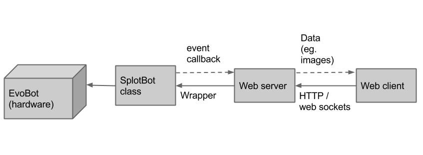

# Achieving modularity in hardware and software

The EvoBot is but a step on the ladder towards the end goals stated by
the EVOBLISS project. It is unclear exactly what functionality will be
required from the platform down the road, this brings a need for
a hardware and software architecture that supports the addition and
replacement of components without requiring major alterations to the
existing setup. Modularity is for this reason considered essential to
the design of the robotic platform.

Modularity is also of importance from the point of view of the user in
getting as much 'experiments for the money' as possible. Modularity in
the robotic platform can be a means of reusing much of the same
hardware for very different experiments, exchanging as little as
possible, rather than having to have a specialized robot for each type
of experiment to run.

In this chapter, we first outline the goals concerning the modularity
of the platform in more practical details. We then describe what we
have done to achieve these goals, followed by a discussion of the
experiences we have made during the course of the project in this
regard.

## Goals

"Modularity" bears varying meaning between people. The modularity we
are discussing is modularity in the hardware components of the robot.
Such hardware components can be added and removed, and the various
hardware setups are supported by the software controlling the robot.
The modularity must exist in several granularities. It must both be
possible to e.g. add an additional syringe or camera to the setup, as
well as removing all components but a single RC servo motor, altering
the setup completely. When discussing these advantages it is important to keep
in mind the requirements they impose on the user, that is, to what degree
we consider it fair to inconvenience the user.

In order for such modularity in hardware to exist, the software must know how to
handle different kinds of components e.g. knowing how to step a stepper motor as
well as knowing what hardware components the setup consists of. Each of these
two can either be done automatically in the software, or it can require user
input. We have defined the requirement as the software having to know how to
handle a number of basic components such as stepper motors and RC servo motors,
while changing the hardware setup requires the user to inform the robot of the
changes made (which components the setup consists of and how it is connected to
the BeagleBone Black). Based on this information, the software provides an
interface to the user, allowing her to control the components.

In the case of the user wanting to use a component not supported by the software,
the software must be altered and recompiled. This introduces a requirement to
the software architecture of the robotic platform. In order to avoid the user /
developer (without meaning to do so) alters the implementation of support for
existing components, support for additional hardware components in the software
must be achievable by implementing a fixed software interface decoupled from the
implementations of the control of existing components.

Of course, an important point in the requirement of modularity is that it is
possible to construct the hardware setup that is the goal of this project with
top and bottom carriages movable along to axes and different components attached
to these. We will denote these as basic requirements, and they can be summed up
as follows:

- The software implementation must contain implementations of the most basic
  components, which are X/Y axes driven by stepper motors, RC servo motors, and
  cameras.
- The design must support the setup of having a top and a bottom carriage moving
  separately along two axes with various other hardware components attached.

Our goals concerning the modularity of the robotic platform will extend the above
and can be summarized in the following points:

- Both the hardware and the software must be constructed in such a way that it
  is possible to exchange an entire component such as adding or removing an RC
  servo motor. Requirements of the user: To inform the robot of the change,
  restart the robot, and calibrates the component if necessary.
- In the software implementation it must be possible to add support for
  additional types of components without making any changes to the existing
  implementation. Requirements of the user: A recompilation of the entire source code.
- The modularity in software covers both the software controlling the hardware
  and the user interface. That is, a change in one can be reflected in the other.
  Requirements of the user: To keep the configuration and code in alignment as 
  described in \ref{configuration for modularity}.

## The current design

The requirement of modularity has deep impact on the overall architecture of the
robotic platform, as the modularity must be reflected in everything, both
hardware and software parts. We will here give an overview of the architecture
and components, followed by a more detailed explanation of how the different
parts of the architecture are designed.

### The architecture of EvoBot

The architecture of EvoBot is outlined in figure \ref{fig:architecture_overview}
showing the interaction between the four main parts of the robotic platform. The
architecture is layered (the bottom layer is to the left in the figure); the
first two parts cover the hardware itself and the controlling of it, and the
next two parts are an attempt to create an environment in which the user
interface can be built.

- The bottom layer of the architecture is the hardware. The basis of the
  hardware is the frame on which the rest of the components are mounted. Each
  hardware component is then considered an individual module in the
  architecture. This is e.g. an RC servo motor, a set of X/Y axes driven by
  stepper motors, or a camera.
- The next layer is the software controlling the hardware. It is initialized
  from a configuration file defining the hardware, creating the coupling
  between the software and the hardware. This allows for modularity to the
  extend that modules can be added and removed requiring only that the
  configuration file is updated accordingly and the robot rebooted. This layer
  also include the logging of experiment data. This layer communicates only with
  the below layer (the hardware) through GPIO manipulation.
- The basis for the user interface is a web server. This is a thin wrapper on
  top of the below layer controlling the hardware, allowing for a simple way to
  interact with the robot. This layer communicates both with the below layer
  through function calls and with the above layer through distribution of events
  such as e.g. the event of a camera detecting a droplet with certain
  properties.
- The top layer is the graphical user interface itself, interacting only with
  the below web server. In this layer, the configuration file used for
  initializing the software layer controlling the hardware is also loaded. Based
  on this file the graphical user interface is built, continuing the coupling
  between the hardware and the software to also include the graphical user
  interface, as an attempt to support the goals of modularity. This layer
  interacts with the below layer by sending instructions to the robot and
  through receiving events transmitted by the below layer.

The architecture reflects the modularity in all layers. In the architecture,
the hardware components are considered separate modules, and the same modules
are represented as modules in the remaining layers (except for the web server
which knows no logic but simply forwards incoming requests from the below and
above layers). 

### Configuration for modularity

As mentioned in the architecture description, the coupling between hardware
and software is done in a configuration file. This configuration file
then ensures that the user interface and hardware interacting components are
in sync, allowing hardware components to be trivially added.

The goal that the robot must know a number of basic components is a
question of implementing these in (1) the software layer controlling the
hardware, and (2) in the user interface. Currently, the components implemented
are:

- `XYAxes`. A set of two axes driven by stepper motors.
- `RCServoMotor`. An RC servo motor capable of rotating 90 degrees.
- `Camera`. A camera capable of grabbing images from a video device and
  doing droplet detection. 
- `Scanner`. A component with no corresponding hardware component, which
  instead makes use of existing `XYAxes` and `Camera` components to
  grab multiple images and stitching them together using computer vision
  techniques, resulting in the scan of a surface area larger than what can be
  grabbed in a single image.
- //TODO add the rest of the components when done

More such components can be added in the software as defined in the
requirements. The implementation of a component is done in the following steps:

- The settings of the component must be defined e.g. a syringe component which
  consists of two servo motors connected to the Servo Controller. The definition
  must be reflected in the configuration file. The definition must at the very
  least have a type name (e.g. Syringe), a name (unique for each component
  instance), and how it is connected to the peripherals of the BeagleBone Black.
- The component must be implemented, inheriting from the `Component` C++ class
  and implementing the virtual methods.
- The `componentinitializer.cpp` file must be updated to know about this new
  type of component including how to initialize it from the configuration file.
- In the client, a corresponding GUI component must be implemented, and the
  service `configService` in the file `config.js` must be updated to know
  the number of actions registered by the new component.

The fulfillment of the last requirement is reflecting in the fact that the
current setup is functioning correctly. //TODO remove this line if it does not,
indeed, function correctly

The following sections go in more details which some of the different design
decisions behind the architecture.

#### The structure of the configuration file
//TODO

### Modularity in the hardware
//TODO

### The use of BeagleBone Black peripherals
//TODO

## Issues with the current design
During the course of the project, some limitations in the current design have
revealed themselves, some of which would require a complete revision of the
architecture of the robotic platform, if they are to be overcome.

One of the major limitations lie in the use of the limited number of
peripherals of the BeagleBone Black. With the BeBoPr++ cape attached, the
robotic platform supports up to four stepper motors with no way of adding
additional stepper motors, if they are to be controlled in the same way as the
existing four stepper motors. The issue has several causes:

- The BeBoPr++ cape is a very specialized cape for running 3D-printing hardware
  directly from the peripherals of the cape. The cape targets are specific
  printer (Mendel), making the hardware for which it is made very fixed in its
  nature. This means that the peripherals of the cape are limited to exactly
  what is needed on such a printer. And this is different from what is needed on
  EvoBot. Some existing inputs / outputs are not needed, while other needed
  inputs / outputs does not exist.
- As with the hardware, the software for interacting with the cape is equally
  targeted a specific 3D-printer, meaning that e.g. the logic for controlling
  each of the stepper motors various due to the different use of these motors in
  the 3D-printer setup. Even though we have been able to modify the software
  slightly for our needs, our own software still depends on the quite large and
  complicated piece of software, in which we only use a very small part. This
  further means, that if something does not work as expected in this software,
  it is very difficult for us debug the software, as it functions more or less
  as a black box in which we input G-code and expect the stepper motors to react
  accordingly.

This issue could be overcome by not using the peripherals of the BeagleBone
Black (or the BeBoPr++ cape) and instead using the USB port of the board. A good
example of this is the way in which we control RC servo motors. These motors
are controlled directly from a USB servo controller, of which more can be added,
if more RC servo motors are needed.

The use of the BeBoPr++ cape actually introduces a further complications due to
out asynchronous use of the Mendel software. The first thing is that the way we
simply write to the socket file, which at some point is read by the process
running the Mendel application (in the single-core processor environment). The
other thing is that the Mendel software controls the stepper motors by using one
of the PRUSS of the BeagleBone Black. It does so by enqueing a piece of assembler
code to be run on the PRUSS, which it the executes as some point. In the end,
the result is that it is very difficult for us to know exactly when stepper
motors are run. One of the places where this is visible is when homing a pair of
X/Y axes on EvoBot, which is achieved by sending a G-code command to the Mendel
software and sleeping for some time, during which we expect the motors to move,
after which we check if the limit switch is pressed.  In practice, this has
worked every single time, though it makes the homing process quite cumbersome to
the long total sleep time, but in theory, some special case of process scheduling
in the CPU could result in the motor not moving until after a new command has
been sent to the Mendel software. This issue can easily be forced by lowering
the time slept (currently 1 second), in which case it becomes apparent in
practice as well.

A final issue with the BeBoPr++ cape is the price. We currently use it only for
controlling 4 stepper motors (and for circuit protection), but the cost of it is
about twice the cost of the BeagleBone Black itself. And on top of the price,
the stepper motor drivers have to be bought separately. This is quite expensive
for controlling only the stepper motors.

Another limitation in the current design is in the somewhat complex process of
adding support for additional components in the software, in which case quite
the number of different files must be modified. This makes sense, if the module
added is very different from existing components, so the logic is completely
new. But it is difficult to justify the complexity, when e.g. a new module must
be added which simply is capable of controlling two RC servo motors in parallel,
when the logic of controlling a single RC servo motor is already implemented.
Furthermore, the current design until partially fulfills the requirement
concerning of the developer not risking to break the code of existing
components, since some files shared between the components must be edited.

In the following, we outline our recommendation of how modularity could be
designed into the EvoBot, overcoming the above limitations.

## Recommendation of a better design
Working with the design as it currently looks, having to work with the
limitations inherent in the design decisions made, we have made a design of the
architecture which we believe would avoid the issues discussed above. We will
here briefly outline this design.

The architecture of the recommended design is achieved by splitting the
responsibility of the software controlling the hardware into to layers. This is
illustrated in figure \ref{fig:recommended_architecture_overview}. Rather than
controlling the hardware directly from the peripherals of the BeagleBone Black,
each module has a corresponding microcontroller which knows the logic of how to
control the hardware. Each microcontroller is also capable of registering itself
as a component with the BeagleBone Black. This can be achieved by some standard
interface, of the BeagleBone Black sending a predefined command to each attached
component, which in turn sends back meta data explaining how to control the
component. 

The meta data must be designed in such a way that it can be understood by the
BeagleBone Black which can automatically generate a user interface for each
component. This could quite simply be achieved by the meta data containing a
definition of each action the module is capable of executing, including the
action number and number of arguments and a name of each of these, along with
the events emitted from the component and a similar definition of these.
Instructions could then be sent to component as strings over the serial port
similar to G-code strings. The flow of information between a microcontroller and
the BeagleBone Black is illustrated in figure
\ref{fig:recommended_software_flow}.

//TODO should we have an example of such metadata and an instruction string?

As a result of the above, the current configuration file would not be needed, as
the components would now be capable of registering themselves at startup. This
would make the modification of the hardware setup more seamless.

In the recommended design, the camera would have to be considered as a special
kind of component, as the camera component does more than simply manipulation of
input and output ports. The question is where the image analysis and processing
is to take place. We have considered the following two options:

1.  The camera could be attached directly to the BeagleBone Black as currently is
    the case, and the board could take care of the image analysis and processing.
1.  The camera could be attached to a device capable of doing the image analysis
    and processing, which then registers itself as a component in the same way
    as the other components.

Our experiences with doing image analysis and processing on the BeagleBone Black
have shown performance issues. The board can at most use a single camera at a time,
and it is at the cost of most of the processing power. So from a performance
point of view, the second option is preferable. However, from a cost
perspective, having multiple boards with general purpose CPUs are likely to
increase the overall price of the robot. Still, the second option remains our
recommendation, as it is the most likely to result in the most stable robotic
platform, not suffering from sudden delays in the experiments run due to spikes
in the use of the CPU of the BeagleBone Black. //TODO we have to try with more
cameras before making this statement

Similar to the camera, the current setup consists of modules such as the
`Scanner`, that control no separate piece of hardware, but which rather is a
container of logic that has references to other components which through which
it manipulates hardware. Again, these components can either exist solely in the
logic of the BeagleBone Black, or they can be a separate controller. The
recommendation remains the same as with the camera that the processing should be
contained in a separate hardware unit. This adds are requirement that the
BeagleBone Black provides an interface to the components for both (1)
discovering each other, e.g. a `Scanner` component must be able to discover a
`Camera` and an `XYAxes` component, and (2) for sending instructions to each
other.

This new architecture has the advantages over the existing architecture that it
fulfills the requirements to the modularity in a stronger sense than the current
design, making it easier for users to alter the hardware setup, while also
moving the heavy processing between multiple components. But it is at the cost
of introducing a lot more controllers to EvoBot thereby increasing the overall
cost of the robotic platform.

//TODO what other issues might there be with such a design?
