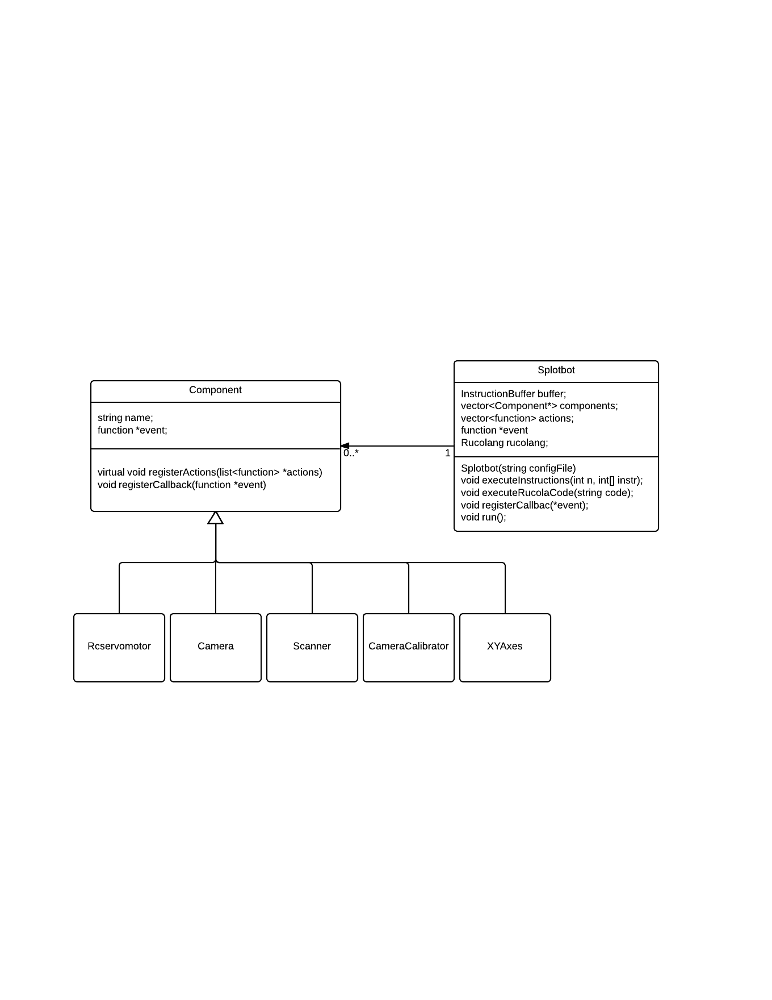

#Building the software to control EvoBot 
\label{sec:software}
In this chapter we first introduce the software used to control Splotbot and compare
it with the software developed for EvoBot. Then we look at how the EvoBot core
software application is constructed. Finally we look at the interaction between
software and hardware.

##The software used to control Splotbot
The software controlling Splotbot is written in Python. It is based on
the Printrun [@printrun] application made for controlling 3D printers.
The hardware is controlled by sending G-code instructions to the
Arduino microcontroller of Splotbot. The software runs on a personal
computer connected to the Arduino board through USB. The camera of the
setup is also connected directly to the personal computer.

##From Splotbot to EvoBot
The software for controlling EvoBot is rewritten entirely from
scratch. This rewrite is needed for several reasons. The electronics
of the hardware setup has changed a lot, replacing the Arduino board
with the BeagleBone Black, as we seek to make the robotic platform
completely stand alone. This means that the software core no longer
runs on the personal computer of the user, but on the BeagleBone
Black. As the board is limited in computational power, we wanted to
use a lower level language with better performance to partially make
up for this.

EvoBot also differs from Splotbot in that it has to be a platform for
executing many different types of experiments which might require
altering the hardware setup. We emphasise a software architecture that
allows the functionality to be extended with other types of hardware.

##Constructing the software core 
\label{sec:software_constructing}
The core of the software is written in C++ and is responsible for executing
experiment code, communicating with the hardware, logging data, emitting events
and in general it is the most extensive part of our code base. It 
consists of a module based system where modules are loaded at startup based on
settings in a configuration file. This allows for modularity in our design and
for the hardware setup to be altered in the future.

The center of the software core is the `Splotbot` class, which was given the
name before the robot became EvoBot. The `Splotbot` class constructs all the
software components from the configuration file. All of the components are then
instructed to register their actions in the action list, a list of every
instruction that can be executed on the robot. The action list is later used to
call the different component actions. Currently EvoBot has five available
components each with different functionality and hardware requirements, also
depicted in figure \ref{fig:class_core}:

- **Camera** handles video recording, image grabbing, and droplet 
  tracking
- **XYAxes** is used to control a set of two axes on the robot. It has
  functionality to move the carriage to a specific position and for homing 
  the position of the carriage to its initial value 
- **RCServoMotor** is used for a single servo motor and has functionality to
  move it. In a more complete setup a component type such as a '`Syringe`'
  would probably be used instead of this component
- **CameraCalibrator** is used for calibrating the camera. This component has
  functionality to perform a camera calibration and for saving and
  loading such calibrations
- **Scanner** is used to scan large surface areas using image
  stitching techniques

An important part of the design of the software core has been to ensure that it
is kept modular with the intention of making it possible to extend it with more
hardware options in the future. Modularity is achieved by making components for
each feature of the robot encapsulate the functionality in a single place. A
component is then defined in the configuration file to signal to the software
that it should be available. Implementing a component can be done by using the
following steps:

- The settings of the component must be defined, e.g. a syringe component which
  consists of two servo motors connected to the physical servo controller. The
  definition must be reflected in the configuration file. The definition must at
  the very least have a type name (e.g. **Syringe**), a name (unique for each
  component instance), and how it is connected to the peripherals of the
  BeagleBone Black.
- The component must be implemented as a class, inheriting from the `Component` C++ class
  and implementing the virtual methods.
- The `componentinitializer.cpp` file must be updated to know about this new
  type of component including how to initialize it from the configuration file.

The configuration file is written in JSON. An example of a component in a
configuration file can be seen in figure \ref{fig:example_config}.  As a part
of the configuration every component needs to state its type, name, and some
parameters that the C++ code of the component will use. The parameters are
often used to define to which ports the hardware is connected.

A limitation in the current design is in the somewhat complex process of adding
support for additional components in the software, in which case quite a
number of different files must be modified. This makes sense, if the module
added is very different from existing components, so the logic is completely
new. But it is difficult to justify the complexity, when e.g. a new module must
be added which simply is capable of controlling two RC servo motors in parallel,
when the logic of controlling a single RC servo motor is already implemented. It
also introduces a risk of breaking existing code when introducing new.

\begin{figure}
\begin{lstlisting}[language=json,firstnumber=1]
{
    "type": "XYAxes",
    "name": "BottomAxes",
    "parameters": {
            "x_port": "X",
            "y_port": "Y",
            "x_limit_switch_port": "J9",
            "y_limit_switch_port": "J11",
            "x_step_limit": 79,
            "y_step_limit": 58
    }
}
\end{lstlisting}
\caption{Example config}
\label{fig:example_config}
\end{figure}

## Controlling the hardware from software
EvoBot consists of multiple hardware components which are all accessed in
different ways. This section serves as a description for each of the hardware
components accessed and explains how they are controlled.

- The stepper motors and limit switches are controlled through the BeBoPr++
cape on which the BeagleBone Black is attached. 
- RC servo motors and cameras are controlled through USB, the cameras being
directly connected to the BBB, while the RC servo motors are connected to the
USB controlled servo controller which is then connected to the BeagleBone Black.

The servo controller can be controlled by sending simple commands to the serial
port. We based our implementation of this on the C program available on the
Pololu website [@pololucode].

The camera registers itself as a video device, which can be accessed through
OpenCV that uses the video4linux driver. But there are some issues regarding
video codes, as OpenCV depends on FFmpeg which in turn depends on the codecs
installed. While we found a codec that worked on the BeagleBone Black, it did
not always work on each of our development computers, making a common
configuration impossible.

The limit switches are easily accessed through virtual files in the file system.

With the stepper motors, the interaction becomes a lot more complex. As far as
we have been able to figure out, the design of the BeBoPr++ cape means that the
stepper motors can only be controlled through the PRUSS microcontrollers on the
BeagleBone Black. The BeBoPr++ cape comes with a piece of open source software,
`BeBoPr` [@bebopr_repo], which can be used for controlling the peripherals of the cape. The
cape is, however, designed for controlling a specific 3D printer, and the
software is written solely with this in mind. This means that the only way to
control the software is by sending G-code strings to standard input of the
process running it. As a further note, the stepper motors of the 3D printer have
different functions, and the `BeBoPr` applications therefore treats them
differently. But on EvoBot, the motors must all be treated the same. To
solve this, we have made slight changes to the `BeBoPr` software, making sure:

1. All the stepper motors are treated the same
2. The software does not check that the motors have stepped past their limits

Furthermore, as a part of starting the EvoBot software we:

1. Create or truncate a text file
2. Start the `BeBoPr` software
3. Open a continuous stream reading from the file and pipe it into the
   `BeBoPr` process
4. Pass the path to the file to the EvoBot software

This way, every time an instruction must be sent to the BeBoPr++ cape, we write
the G-code to the text file which is then read by the `BeBoPr` application and
executed. 

This asynchronous use of the BeBoPr++ cape introduces complications. The first
thing is the way we simply write to the socket file, which at some point is read
by the process running the `BeBoPr` application (in the single-core processor
environment). The other thing is that the `BeBoPr` software controls the stepper
motors by using one of the PRUSS of the BeagleBone Black. It does so by enqueing
a piece of assembler code to be run on the PRUSS, which it the executes as some
point. In the end, the result is that it is very difficult for us to know
exactly when stepper motors have moved. One of the places where this is visible
is when homing a pair of x and y axes on EvoBot. This is achieved by sending a
G-code command to the `BeBoPr` software and sleeping for some time, during which
we expect the motors to move. Afterwards we check if the limit switch is
pressed. If not, the process is repeated. In practice, this has worked every
single time, though it makes the homing process quite cumbersome because of the
long total sleep time.  But in theory, some special case of process scheduling
in the CPU could result in the motor not moving until after a new command has
been sent to the `BeBoPr` software. This issue can easily be forced by lowering
the time slept (currently 1 second), in which case it becomes apparent in
practice as well.

As a further issue with the stepper motors, we have repeatedly experienced that
when sending multiple instructions to the `BeBoPr` application to move the
stepper motors, only some of the instructions are actually executed. Then when
sending a new move instruction, all the instruction not executed gets executed,
including the new one. At first sight this appears to be an issue with a buffer
not being flushed correctly. But we have not found the time to look further into
the issue.

##Summary
The software used to control Splotbot is written in Python and uses the Printrun
application, also written in Python, to send G-code instructions to the Arduino
controller, which controls the hardware. EvoBot is inherently different in that
the Arduino board is replaced with the BeagleBone Black, as the robot must be
standalone. This also means the software runs on the BeagleBone Black rather
than on the personal computer of the user. Also, the architecture of EvoBot
focuses on modularity. Due to this as well as performance considerations, the
software for controlling EvoBot was written from scratch in C++.

The core software was designed with modularity in mind, resulting in a class
structure with classes representing components, each encapsulating the logic of
controlling a corresponding hardware component. The components are instantiated
at startup based on a configuration file written in JSON.

Each of the hardware components is controlled differently from software. The
camera is registered as a video device. The RC servo motors are controlled by
writing strings to the serial port on which the servo controller is connected.
Whether or not the limit switches are pressed can be read from a virtual file in
the file system. The stepper motors prove difficult, as we had to modify the
open source software accompanying the BeBoPr++ cape as well running this
software as a separate process to which we write G-code in order to control
them.
