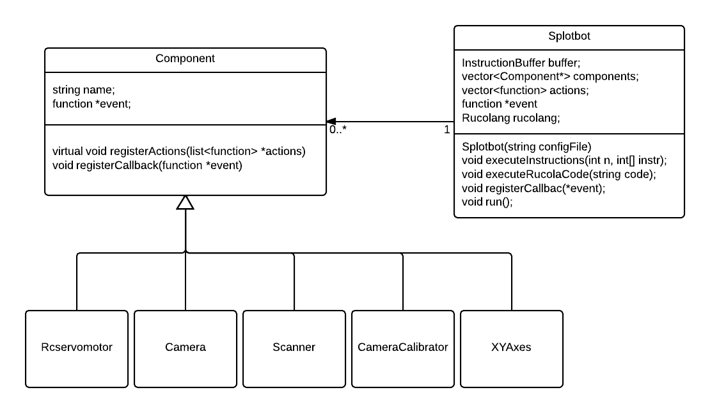

#Building the software to control the EvoBot
In this chapter we will first describe how the software in the Splotbot is
implemented. We will then compare the Splotbot's software with the EvoBot's
software. Then we will look at how the EvoBot's core software application is
constructed and finally we will look at how the core software accessed the
EvoBot's hardware

##Description of the software running Splotbot
<!-- Controlling using GCode -->
The core of the software that is used to run Splotbot is the Printrun python
based software. Printrun is made for RepRap 3D printers. It takes gcode
instructions and translates them to motor movements etc. used to 3D print items.
The Splotbot can therefor be controlled by writing a set of gcode instructions
to move it's xy axes.

<!-- Python code -->
Written on top of the Printrun code is Splotbots custom python software. This
software generates gcode that can then be run by Printrun to get Splotbot to
perform actions. The Splotbot software is structured much like a library and
contains code for doing camera calibration, droplet tracking, robot movement and
controlling the syringes. In combination these features can be used to design
experiments to be run on the Splotbot.

<!-- Experiments -->
Experiments for Splotbot are design as Python scripts using the rest of the
Splotbot code to provide the needed functionality. Experiments previously run on
the Splotbot includes taking liquid from containers and inject them into a petri
dish, tracking a droplet and reacting to the droplet speed injecting more liquid
when the droplet movement have halted.

##From Splotbot to EvoBot
<!-- Intro -->
The EvoBot software differers from the Splotbot software in many ways and is a
complete rewrite of most of the functionality including new features. The
software is no longer Python based and is instead written in C++. The main
objective of the software is now to a single application that is run on the
EvoBot and experiments are created by interacting with the software. EvoBot also
differers from Splotbot in that it has to be a platform for making many different
types of experiments which might require other hardware to be added to the
system.

<!-- Software core -->
The software still supports features such as droplet tracking, moving the
carriage and moving servo motors. But has extended with features such as
scanning, a web interface and a programming language. Focus has been put on
making a standalone robot with a software that can be connected to and used
without the need of writing or changing the C++ code.

<!-- Features: Droplet tracking, moving camera, scanning, programming language,
web interface -->
Experiments are now run by using the EvoBot software rather than extending it
with a new python script. Experiment can either be defined as low level
instructions similar to Gcode or via a domain specific programming language
(DSL) made for and run via the EvoBot's software. The EvoBot also supports the
possibility of making experiments that observes the status of the petri dish and
reacts based on it, such as watching the droplet's changes in speed.

##Description of the software running the EvoBot

The software written for our prototype is structured in three main components,
the core, the NodeJS server code and the client. The core handles the robot
features, the NodeJS acts as a bridge between the core and the client and the
client allows the user to manipulate the robot real-time and via sending
experiment code. Below is a description of the software in its entirety. The
code for our implementation is available in our Github repository
[@bachelor_code]

<!-- Core -->
- The core of the software is written in C++ and is responsible for executing
  experiments, communicating with the hardware, logging data, emitting events
  and in general it is the most extensive part of our code base with the main
  responsibility for handling the platform. The software consists of a module
  based system where modules can be loaded and runtime based on settings in a
  configuration file, this allows for modularity in our design.
<!-- Rucola -->
- The EvoBot becomes programmable for a user through the use of a custom DSL
  language called Rucola. We designed this language to fit the needs for
  creating experiments. Rucola is available as a library, which the core
  application uses to compile and evaluate Rucola code.
<!-- Computer vision -->
- As part of our application we have a library of computer vision related tools
  that some of the components in the core application uses to provide features
  such as droplet detection and image scanning.
<!-- NodeJS Server -->
- The NodeJS part of the application wraps the core application providing it
  through a web socket and REST http interface. This makes EvoBot into a web
  service that can be access through any application language that supports
  either web sockets or http.
<!-- Client -->
- The client consist of a JavaScript based web client, that communicates with
  the server through web sockets and http requests. The client similar to the
  server loads the configuration file and constructs the GUI based on the
  available components.

##Constructing the software core 

<!-- (or how we support modularity) -->
The software core spawns from the Splotbot class, which was given the name
before the robot became EvoBot. The Splotbot class constructs all the
components from the configuration file. All of the components are then
instructed to register all of their actions in the action list. The action list
is later used to call of the different component actions. Currently the EvoBot
has 5 available components each with different functionality and hardware
requirements:

<!-- Current components -->
- **Camera** handles the general video recording of the experiment. But it
  also handles the droplet tracking when it has been instructed to turn it on.
- **XYAxes** are used to control a set of two axis on the robot, currently we
  have a top axes and bottom axes. Where the bottom axes are the one containing
  the camera. The XYAxes has functionally such as move to a specific position
  and homing it.
- **Rcservomotor** are used for a single servo motor and has functionality to
  move it. In a complete setup this class would probably not be used in favor of
  using a class such as a "syringe".
- **CameraCalibrator** are used for calibrating the camera. This component have
  functionality to perform a camera calibration, but also to just load the most
  recent from a file.
- **Scanner** are used to scan large surface areas using image stitching.

An important part of the design of the software core have been to ensure that it
is kept modular with the intention and making it possible to extend it with more
hardware options in the future. Modularity is achieved by making components for
each feature of the robot encapsulating the functionality in a single place. A
component is then defined in the configuration file to signal to the software
that it should be available. Implementing a component can be done by using the
following steps:

- The settings of the component must be defined e.g. a syringe component which
  consists of two servo motors connected to the Servo Controller. The definition
  must be reflected in the configuration file. The definition must at the very
  least have a type name (e.g. Syringe), a name (unique for each component
  instance), and how it is connected to the peripherals of the BeagleBone Black.
- The component must be implemented, inheriting from the `Component` C++ class
  and implementing the virtual methods.
- The `componentinitializer.cpp` file must be updated to know about this new
  type of component including how to initialize it from the configuration file.

The configuration file is written in JSON and an example component can be found
below. As a part of the configuration every component needs to state its type,
name and some parameters that the C++ code of the component will use. The
parameters are often used to define on which ports hardware can be accessed.

```json
	{
		"type": "XYAxes",
		"name": "BottomAxes",
		"parameters": {
			"x_port": "X",
			"y_port": "Y",
			"x_limit_switch_port": "J9",
			"y_limit_switch_port": "J11",
			"x_step_limit": 79,
			"y_step_limit": 58
		}
	}
```

##Controlling the hardware from the software
EvoBot consists of multiple hardware components which are all accessed in
different ways. This section serves as a description for each of the hard
components accessed and explains how we do it.

<!-- Camera, OpenCV -->
- The camera of the application are accessed through OpenCV which uses
  video4linux as its underlying driver. The camera is accessed via the
  VideoCapture class in OpenCV where every frame can be grabbed with a single
  method call.
<!-- Stepper motors, mend.elf -->
- The stepper motors are accessed through the BeBoPr++ 3D printer cape. With
  this cape is a piece of software available that can use gcode to access
  printer hardware including stepper motors. We have however made modifications
  to the software to allow for multiple axe. We patched the software to remove
  boundary restrictions and some calculations related to treating each axis 
  differently. The result is that we can make our own homing functionality on
  each axis and that the work similar. To use the application we start it and
  makes it read from a file using the Unix tail on a file and we then write to
  this file to transmit gcode to it.
<!-- Servo motors, C code -->
- The servo motors are connected via the Pololu Servo Controller and can be
  directly communicated to through writing to the USB device. We based our
  implementation on the C program available on the Pololu website [@pololucode]

##Summary
In this chapter we first looked at the Splotbot's software implementation, we
then compared this implementation to the EvoBot's software implementation. We
then described the complete software that is running the EvoBot. Then we looked
at how the software core is constructed and finally we looked at how the
software core controls the different kind of hardware available in the EvoBot.
