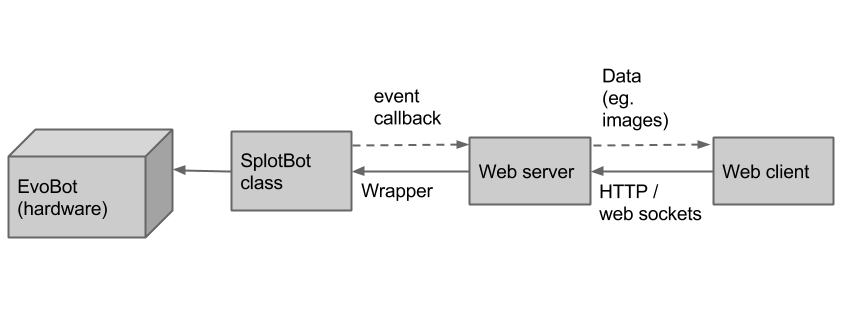

#Building the software to control the EvoBot
\label{sec:software}
In this chapter we will first describe how the software in Splotbot is
implemented. We will then compare the software of the Splotbot with that
of the EvoBot. Then we will look at how the EvoBot core software application is
constructed. Finally we will look at how the core software accesses the
EvoBot hardware

##Description of the software running Splotbot
<!-- Controlling using GCode -->
The core of the software that is used to run Splotbot is the python
based software Printrun . Printrun is made for RepRap 3D printers. It
takes G-code
instructions and translates them to motor movements etc. The Splotbot can be
controlled by writing a set of G-code instructions to move the hardware because
most of the common functionality, such as moving axes, is accessible by
G-code.

<!-- Python code -->
Splotbot can be controlled by the use of a piece of python software built on top
of Printrun. This software generates G-code that is executed by
Printrun resulting in movement of Splotbot. The Splotbot software is
structured much like a library and contains code for doing camera
calibration, droplet tracking, robot movement and controlling the
syringes. In combination these features can be used to design
experiments to be run on the Splotbot.

<!-- Experiments -->
Experiments for Splotbot are designed as Python scripts using the rest of the
Splotbot code to provide the needed functionality. Experiments previously run on
the Splotbot includes taking liquid from containers and injecting it into a petri
dish, tracking a droplet and reacting to the droplet speed.

##From Splotbot to EvoBot
<!-- Intro -->
The EvoBot software differs from the Splotbot software in many ways
and is a complete rewrite of most of the functionality available in
the Splotbot while also adding new features. The software is no longer
Python based but is instead written in C++ and JavaScript. The main
objective of the software is now to be a single application that is
run on the EvoBot on startup. EvoBot also differs from Splotbot in
that it has to be a platform for making many different types of
experiments which might require other hardware to be added to the
system. EvoBot therefore puts emphasis an architecture that allows the
functionality to be extended with other types of hardware.

<!-- Software core -->
The software still supports features such as droplet tracking, moving
the carriage, and moving servo motors. But it has been extended with
features such as scanning and stitching a large area, a web interface and
a programming language. Focus has been put on making a standalone
robot to which a user can connect and control without installing
anything on his own computer.

<!-- Features: Droplet tracking, moving camera, scanning, programming language,
web interface -->
Experiments are now run by using the EvoBot software rather than by
writing a python script. Experiments can either be defined as low level
instructions similar to G-code or via a domain specific programming language
(DSL) made for the EvoBot. The EvoBot also
supports the possibility of making experiments that observes the status of the
petri dish and reacts based on it, such as watching change in the
speed of a moving droplet.

##Description of the software running EvoBot



The software written for our prototype is structured in three main
components:
A core, the web server and a client. The core handles the robot
features, the web server acts as a bridge between the core and the client. The
client allows the user to manipulate the robot real-time and also allows the
user to send experiment code to be executed on the EvoBot. Below is a brief description of the
software in its entirety. The source code is available in our
Github repository [@bachelor_code].

<!-- Core -->
- The core of the software is written in C++ and is responsible for executing
  experiment code, communicating with the hardware, logging data, emitting events
  and in general it is the most extensive part of our code base with the main
  responsibility for handling the platform. The software consists of a module
  based system where modules are loaded at startup based on settings in a
  configuration file. This allows for modularity in our design and for new
  hardware to be added in the future.
<!-- Rucola -->
- The EvoBot becomes programmable for a user through the use of a custom DSL
  language called Rucola. We designed this language to fit the needs for
  creating experiments. Rucola is available as a library, which the core
  application uses to compile and evaluate Rucola code.
<!-- Computer vision -->
- As part of our application we have a library of computer vision related tools
  that some of the components in the core application uses to provide features
  such as droplet detection and image scanning.
<!-- NodeJS Server -->
- The web server, written in NodeJS, wraps the core application providing access
  to it through a web socket and REST http interface. This means that
  EvoBot functions as a 
  web service that can be accessed through any application language that supports
  either web sockets or http.
<!-- Client -->
- The client consist of a JavaScript based web client, that communicates with
  the server through web sockets and http requests. Like the core
  application, the client similar loads the configuration file and constructs 
  the GUI based on this.

##Constructing the software core 
\label{sec:software_constructing}


<!-- (or how we support modularity) -->
The software core spawns from the Splotbot class, which was given the name
before the robot became EvoBot. The Splotbot class constructs all the
components from the configuration file. All of the components are then
instructed to register all of their actions in the action list. The action list
is later used to call of the different component actions. Currently the EvoBot
has five available components each with different functionality and hardware
requirements:

<!-- Current components -->
- **Camera** handles video recording, image grabbing, and droplet 
  tracking.
- **XYAxes** is used to control a set of two axes on the robot. The XYAxes has
  functionally such as moving to a specific position, and homing,
  resetting the position of the carriage to its initial value. 
- **RCServoMotor** is used for a single servo motor and has functionality to
  move it. In a more complete setup this class would probably not be used in favor of
  using a class such as a 'syringe'.
- **CameraCalibrator** is used for calibrating the camera. This component has
  functionality to perform a camera calibration, and for saving and
  loading such calibrations.
- **Scanner** is used to scan large surface areas using image
  stitching techniques.

An important part of the design of the software core has been to ensure that it
is kept modular with the intention of making it possible to extend it with more
hardware options in the future. Modularity is achieved by making components for
each feature of the robot encapsulating the functionality in a single place. A
component is then defined in the configuration file to signal to the software
that it should be available. Implementing a component can be done by using the
following steps:

- The settings of the component must be defined e.g. a syringe component which
  consists of two servo motors connected to the physical Servo Controller. The definition
  must be reflected in the configuration file. The definition must at the very
  least have a type name (e.g. Syringe), a name (unique for each component
  instance), and how it is connected to the peripherals of the BeagleBone Black.
- The component must be implemented, inheriting from the `Component` C++ class
  and implementing the virtual methods.
- The `componentinitializer.cpp` file must be updated to know about this new
  type of component including how to initialize it from the configuration file.

The configuration file is written in JSON, an example component can be found
below. As a part of the configuration every component needs to state its type,
name and some parameters that the C++ code of the component will use. The
parameters are often used to define on which ports some hardware can be
accessed.

```json
	{
		"type": "XYAxes",
		"name": "BottomAxes",
		"parameters": {
			"x_port": "X",
			"y_port": "Y",
			"x_limit_switch_port": "J9",
			"y_limit_switch_port": "J11",
			"x_step_limit": 79,
			"y_step_limit": 58
		}
	}
```

##Controlling the hardware from the software
EvoBot consists of multiple hardware components which are all accessed in
different ways. This section serves as a description for each of the hardware
components accessed and explains how they are controlled.

<!-- Camera, OpenCV -->
- The camera of the application are accessed through OpenCV which uses
  video4linux as its underlying driver. The camera is accessed via the
  VideoCapture class in OpenCV where every frame can be grabbed with a single
  method call.
<!-- Stepper motors, mend.elf -->
- The stepper motors are accessed through the BeBoPr++ 3D printer cape.  This
  cape comes with software capable of executing G-code instructions,
  controlling the hardware. We have however modified the software to
  treat the 4 axes equally. We patched the software to remove boundary
  restrictions and to fix some calculations to make sure each axis moves at the
  same step size. The result is that we can make our own homing functionality on
  each axis. To use the 3D printer
  application we redirect its stdin to a file and we 
  write G-code to this file to transmit it to the application.
<!-- Servo motors, C code -->
- The servo motors are connected via the Pololu Servo Controller and can be
  directly communicated to through writing to the USB device. We based our
  implementation on the C program available on the Pololu website
  [@pololucode].

##Summary

The Splotbot is run on a piece of Python software based on a library
specifically used for controlling a 3D printer. The transition from
Splotbot to EvoBot is very much a rewrite, resulting in a C++ library
exposed through a web server, operated with a Javascript based web
client. The core of the EvoBot consists of different component working
as an abstraction on top of the corresponding hardware components.
