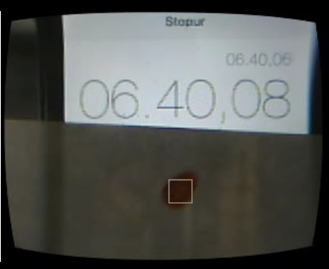

# Extracting experiment data using computer vision techniques
\label{sec:tracking}

Having a platform for conducting experiments requires a bridge between
the scientist designing the experiment and the results from the
experiments. It is the most noble of tasks for a platform such as the
EvoBot to not only extract this data but also to aid the scientist in
understanding what is actually found in her experiments. One of the
tools for doing is to visually aid in finding areas of interest
from the recorded experiments. To do this, EvoBot will facilitate
droplet tracking.

The following will attempt to clarify the exact goals of this task,
followed by an account of how the task is solved in the Splotbot
and EvoBot platforms respectively. Finally a series of experiments
are made to illustrate the success of this implementation along with
a discussion of the results.

## Goals

The goals in this regard are rather simple. The EvoBot must **show
a live feed from a camera**, and **upon clicking an area of interest
the user will see the object clearly marked**. 'Object' here refers
to a patch of color similar to and surrounding the clicked point
in the image. In actual terms, this should amount to a droplet in
a biological experiment. 

In addition to visually marking the object, **relevant information must be
extracted from the droplets properties**. Given a lacking knowledge of which
attributes are actually interesting we will limit ourselves to showing the speed
of the droplet and nothing else. Other properties could be the size of the
droplet, the circularity, etc.

An important consideration aside from the features listed, is that
performance can be impacted by such a feature. Droplet tracking will
operate on a live video feed, and will impact each frame. This will
likely cause degraded performance. It is difficult to put an exact
number on how much degradation can be accepted, but it is important to
consider.

## Droplet detection in Splotbot

The droplet detection and tracking done in the Splotbot project is
thoroughly covered in the thesis by Gutierrez [@gutierrez2012, p. 134-140]. In the
interest of readability of this report, the following is an attempt at
describing the parts relevant for the EvoBot project.

Droplet tracking is a twofold process consisting of 

- Finding the droplet to track
- Track the path of the droplet

The tracking part is done using an advanced AI technique known as Self
Organizing Maps. For the EvoBot project a different approach is taken,
and it is therefore out of scope to describe this part. The part about
finding the droplet is, however, relevant and is described in the 
following.

In Splotbot, finding the droplet is based on the user clicking the object of
interest before the experiments starts. Like EvoBot, Splotbot uses OpenCV for
most if not all vision related functionality. Gutierrez considers three
different segmentation methods for detection the droplet:

- **Motion based**, subtracting frames from each other and seeing
shifts in color. However, this is shown to not be robust. Because subtle changes
in lightning has big effects.

**Shape based**, that is, to consider the shape of droplet as the
unique property of each droplet. Hough transform, a voting based
system for finding circles, is considered to base the shape on the
circularity measurements of objects. Is discarded because circularity
is not guaranteed in the droplets.

**Color based**, that is, consider the color value of a pixel
as the defining factor for a droplet. To compare against other pixels
in the image, the distance in HSV space is measured (three dimensional
vectors) and similarity is held against a threshold to determine
whether it should be considered an object of interest. Color based
segmentation is chosen as it proves to be most robust.

Aside from the segmentation itself morphology is performed on the
image to remove noise. Output is a binary image for each tracked
object. The binary images are finally joined together with an XOR
operation.

## Droplet detection in EvoBot

As described in the previous section, a lot of work in terms of droplet
detection has been done in the Splotbot project. It makes sense to reuse at
much as possible of the knowledge gained in that project. Careful
considerations have gone into the choices of technology and algorithms of
course, but the Splotbot report is seen as a credible source of information.
With this in mind, droplet detection in EvoBot consists of the following steps

1. User input determines pixel of interest
2. The color of the selected pixel determines blob of interest
3. To better extract the blob of interest, noise is removed using
a filter
4. A binary image is extracted based on color segmentation, 
not motion nor shape of the droplet
5. Morphology is applied to the binary image, to remove for 'holes' in the
blob
6. Droplets matching the size and color of the droplet are selected
7. Of these the largest droplet is chosen as the one to be tracked.

This is done repeatedly on each frame, and results in a continous tracking
of the droplet.

### Considerations on the choice of filter
\label{sec:tracking_considerations_on_the_choice_of_filter}

As mentioned above, we filter the original image, this is done for two reasons.
The firstis to increase the likelihood of the algorithm detecting the entire
droplet. The second is that we seek to achieve as uniform a color of the entire
droplet as possible. This is what @gutierrez2012 achieves by filling the
droplet with the same color. The theory in the case of EvoBot is that the same
effect can be achieved using a correct blurring mechanism.

The effect of this is that the image is blurred before tracking takes
place resulting in a more even color across the droplet as well as
some elimination of noise. We considered three blurring algorithms,
with the following characteristics:

- **Gaussian blur**: Fast, but not edge preserving, degrading the results
- **Bilateral filtering**: Edge preserving, but too slow and only partially removes noise
- **Median filter**: Relatively fast, edge preserving, removes noise very well

Median filter was chosen based on the above criteria. A comparison showcasing
the differences is done in section \ref{sec:tracking_experiments_filters}.

### Considerations on the final choice of droplet

Our implementation can only track one droplet at a time, whereas
@gutierrez2012 demonstrates that the Splotbot has the ability to track
several. It can be argued that Evobot can be extended to
provide this functionality as well. In the underlying code it is
a matter of extending a single method to take a list of colors and
return a list of droplets, however, the design as a whole is more
tricky, as it requires some thought into the user interface design to
make this clear to the user. It is considered out of scope for this
project to look further into this.

## Testing the droplet detection

The following is an attempt at accounting for the success of the droplet
detection implementation. This will be done based on the criteria **degradation
of performance** and **quality of results**. Both of these will judged on
subjective measurements, but are documented based on data extracted from
EvoBot. Lastly, an experiment is done to determine the difference in results of
the different filters discussed.

### Degradation of performance

This experiment serves the purpose of illustrating how big an impact on
performance the implemented droplet detection has. This impact is to
be understood as in terms of actual effect on what is seen by the user.
This means that we have to deal with a comparison of time in the real
world. For this we have chosen the straightforward approach of using
a stopwatch and have designed the following steps for the experiments:

1. An artificial droplet is placed in sight of the camera
1. Also in sight of the camera is a stop watch
1. In the span of 30 seconds, a video is recorded on the camera
1. Droplet detection is turned on
1. Again, 30 seconds of video is recorded
1. The amount of frames captured in each video is compared

Note that this of course has an element of uncertainty, as the 30 second mark
is as measured by us carrying out the experiment, leaving our reaction time as
a source of error. The experiment is run on the BeagleBone black itself for the
most relevant results. An image of the setup can be seen in
\ref{fig:droplet_delay_setup}.

The results are *68* frames in the 30 second video without tracking
and *38* with tracking. This means that the resulting impact from
the droplet detection is approximately **44 % fewer frames**. Given
that the nature of the experiments to be run on the EvoBot are usually
slow moving, we find these results acceptable.

### Quality of results

One of the important aspects of the droplet detection feature is
of course the actual effects it can produce. As mentioned earlier,
this will be done using subjective judgement. To best showcase
the results we tried to mimic a real biological experiment to the
best of our ability. This resulted in the following experiment:

1. A petri dish is filled with transparent cooking oil
1. In the cooking oil, 4 different colours of liquid is placed
1. The petri dish is placed on the camera
1. The petri dish is slowly turned around its own center, moving droplets
from the cameras point of view.
1. While the droplets move, two of them are tracked individually 
as they move across the camera and in and out of the view

From this experiment we see a few interesting things. The first thing to
mention is that the tracking works, as two colors can be tracked individually
and as they move. This is somewhat poorly illustrated with images, but
\ref{fig:experiment_droplet_success} gives an idea about the results.

\begin{figure}[h]
    \centering
    \begin{subfigure}[b]{0.45\textwidth}
        \includegraphics[width=\textwidth]{images/tracking_red}
        \caption{Tracking a red droplet}
    \end{subfigure}%
    ~
    \begin{subfigure}[b]{0.45\textwidth}
        \includegraphics[width=\textwidth]{images/tracking_yellow}
        \caption{Tracking a yellow droplet}
    \end{subfigure}

    \caption{Successful droplet tracking.}
    \label{fig:experiment_droplet_success}
\end{figure}

The next thing to notice is that there are some effects of the implemented
tracking that might strike some as odd. One of these effects is the behaviour
when the droplets are leaving the screen. This results in the square marking
the tracking staying in the camera view on the droplets last known position.
This effect can be seen in figure \ref{fig:experiment_droplet} (a).
The alternative solution to this would be to hide the box when no droplet is
found, however, we do not see this as a negative effect, as it does give
meaningful results (the droplets last known position). It would likely be a
good idea to to confirm this design decision with the users of the robotic
platform.

\begin{figure}
    \centering
    \begin{subfigure}[t]{0.45\textwidth}
        \includegraphics[width=\textwidth]{images/tracking_red_outofbounds}
        \caption{Droplet gone out of bounds}
    \end{subfigure}%
    ~
    \begin{subfigure}[t]{0.45\textwidth}
        \includegraphics[width=\textwidth]{images/tracking_failed}
        \caption{Untracked droplet}
    \end{subfigure}
    ~
    \begin{subfigure}[t]{0.45\textwidth}
        \includegraphics[width=\textwidth]{images/tracking_small_area}
        \caption{Small part of droplet tracked}
    \end{subfigure}

    \caption{Edge cases and problems when trying to detect a droplet.}
    \label{fig:tracking_droplet}
\end{figure}

There are also issues with the implemented tracking functionality.  It is not
robust in all cases, which can easily be illustrated with experiments. We are
aware of this shortcoming, but it is important to keep in mind that the result
of this project is a prototype showcasing the feasibility of the platform, and
as such not all optimizations should be implemented. There are in general two
problems, which are illustrated in figure \ref{fig:tracking_droplet} (b) and
(c).

The first problem shows that the tracking can fail in certain 'edge'
situations. This is illustrated with the droplet being actually at the
edge, but really any change in light source can cause the problem. The
cause of the issue is that we do not update the assigned color of the
droplet over time. This means that the color extracted from the first
clicked pixel is the color used for the droplet throughout the
tracking. There are two ways of solving this. @gutierrez2012 solves
the problem in software by constantly calculating the color of
the droplet based on its most prominent color. Another way to solve it
is by having a better test setup, where lightning does not have as
big an effect.

The second problem shows that in some cases only a small part of the droplet
gets tracked. This is again related to the color of the droplet and
specifically how we make the color consistent across the droplet. As is further
elaborated in \ref{sec:tracking_experiments_filters} we use blurring for this
purpose, whereas the approach taken in @gutierrez2012 is to actually fill the
droplet with the same colour. There is again the solution of a better test
setup, as the culprit is light differences.

### Choice of filters
\label{sec:tracking_experiments_filters}

This experiments serves the purpose of comparing three blurring techniques
to help decide which of them best serves the need of EvoBot. 
The considerations are performance along with the benefits of the
specific technique. The desired benefits are:

- More even color across the droplet
- Elimination of noise

The experiment carried out is as follows:

1. Use an image of two droplets in a petri dish
1. Add some noise on the image (using simple image manipulation
software)
1. Apply each of the three algorithms to the image, with a timestamp before
and after.

These experiments were run on a reference computer with 16GB of ram and a dual
core Intel i7-3520M CPU @ 2.90Ghz, as well as on the BeagleBone Black, allowing
us to assess the filters both in the current setup as well as in a setup with a
more powerful computer.

The image used for the experiments and the results can be seen in figure
\ref{fig:tracking_experiment}. The image, image (a) on the figure, was grabbed
from a video of moving droplets. As mentioned, the salt and pepper noise is
of course artificially added, and quite extensive. It is not of crucial
importance that the chosen blurring technique will be able to remove all of
this noise.

\begin{figure}
    \centering
    \begin{subfigure}[t]{0.45\textwidth}
        \includegraphics[width=\textwidth]{images/tracking_experiment_original}
        \caption{Original image}
    \end{subfigure}%
    ~
    \begin{subfigure}[t]{0.45\textwidth}
        \includegraphics[width=\textwidth]{images/tracking_experiment_gaussian}
        \caption{Gaussian filter}
    \end{subfigure}
    ~
    \begin{subfigure}[t]{0.45\textwidth}
        \includegraphics[width=\textwidth]{images/tracking_experiment_bilateral}
        \caption{Bilateral filter}
    \end{subfigure}%
    ~
    \begin{subfigure}[t]{0.45\textwidth}
        \includegraphics[width=\textwidth]{images/tracking_experiment_median}
        \caption{Median filter}
    \end{subfigure}

    \caption{The resulting images of applying different filters to a noisy image.}
    \label{fig:tracking_experiment}
\end{figure}

The Gaussian filter, image (b), proved, as suspected, to be very fast at
**20ms** on the reference computer and **??ms** on the BeagleBone Black. But it
also gives rather poor results in terms of smoothing out the droplet
colouring. It becomes very 'grainy' and not very even. It also does not
remove the noise, but instead leaves a lot of spots in the droplet. 

The Bilateral filter, image (c), was by far the slowest at **2632ms** on the
reference computer and **??ms** on the BeagleBone Black. It does have nice
results in terms of preserving the edges of the droplet. In appears to have only
removed some of the noise in the image. The performance of the filter is sadly
unacceptable. The performance cost is too much compared to the edge preservation
achieved.

Lastly is the median filter, image (d). Clocking in at **65ms** on the reference
computer and **??ms** on the BeagleBone Black and with very reasonable results,
this is the filter that was chosen. The image shows that all noise is removed in
one pass, and the droplets gets a very even and smooth color. 

## Summary

It is an essential feature of the EvoBot to provide visual aid in the
form of droplet detection. This is a feature that is also present in
the previous iteration, Splotbot. The relevant parts of the Splotbot
report has been extracted and used as an offset of the design of
droplet detection in EvoBot. This section has demonstrated the
implementation with an emphasis on known shortcomings. Arguments have
been posed for some of the design choices that have influenced the
solution, and experiments have been showcased to give an idea about
how well the solutions performs.
