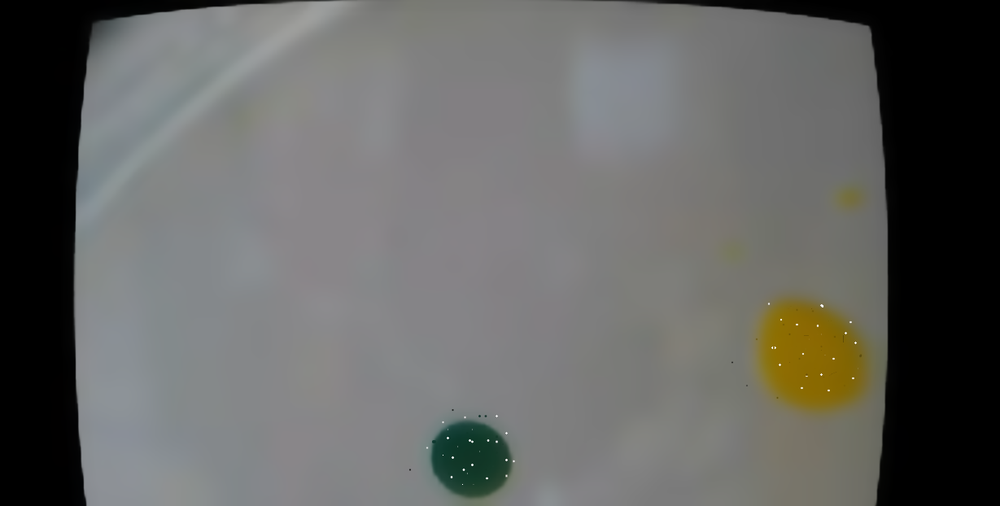

# Extracting experiment data using computer vision techniques

Having a platform for conducting experiments requires a bridge between
the scientist designing the experiment and the results from the
experiments. It is the most noble of tasks for a platform such as the
EvoBot to not only extract this data but also to aid the designer in
understanding what is actually found in her experiments. One of the
tools for doing is to visually aid in finding areas of interest
from the recorded experiments. To do this, EvoBot will facilitate
droplet tracking.

The following will attempt to clarify the exact goals of this task,
followed by an account of how the task is solved in the Splotbot
and EvoBot platform respectively. Finally a series of experiments
are made to illustrate the success of this implementation along with
a discussion of these results

## Goals

The goals in this regard are rather simple. The EvoBot must show
a life feed from a camera, and upon clicking an area of interest
the user will see the object clearly marked. "Object" here refers
to a patch of color similar to and surrounding the clicked point
in the image. In actual terms, this should amount to a droplet in
a biological experiment. 

In addition to visually marking the object, relevant information
must be extracted from the droplets properties. Given a lacking
knowledge of which attributes are actually interesting we will
limit ourselves to showing the speed of the droplet and nothing
else.

An important considerations aside from the features listed, is that
performance can be impacted by such a feature. Droplet tracking
will operate on a live video feed, and will impact each frame, making
for degraded performance. It difficult to put an exact number on how
much degradation can be accepted, but it is important to consider.

# Droplet detection in Splotbot

The droplet detection and tracking done by Juan is thoroughly covered 
in his thesis [@gutierrez2012]. In the interest of readability of this
report, the following is an attempt at describing the parts relevant 
for the EvoBot project.

Droplet tracking is a twofold process consisting of 
- Finding the droplet to track
- Track the path of the droplet

The tracking part is done using an advanced AI technique known as Self
Organized Maps. For the EvoBot project a different approach is taken,
and it is therefore out of scope to describe this part. The part about
finding the droplet is, however, relevant and is described in the 
coming section.

## Finding the droplet

Based on user input for starting the experiment (first frame), that
is user clicks objects of interest. This was shown to be more robust
than automatically doing it infer which frame to start tracking.

Like EvoBot, Splotbot uses OpenCV for most if not all vision related
functionality. This functionality specifically is segmentation. Three
different forms of segmentation is considered in the report

**Motion based**, that is, subtract frames from each other and see
shifts in color. However, this is shown to not be robust. Because
subtle changes in lightning has big effects.

**Shape based**, that is, to consider the shape of droplet as the
unique property of each droplet. Hough transform, a voting based
system for finding circles, is considered to base the shape on the
circularity measurements of objects. Is discarded because circularity
is not guaranteed in the droplets.

**Color based**, that is, consider the color value of a pixel
as the defining factor for a droplet. To compare against other pixels
in the image, the distance in HSV space is measured (three dimensional
vectors) and similarity is held against a threshold to determine
whether it should be considered an object of interest. Color based
segmentation is chosen as it proves to be most robust.

Aside from the segmentation itself morphology is performed on the
image to remove noise. Output is a binary image for each tracked
object. The binary images are finally joined together with an XOR
operation.

# Droplet detection in EvoBot

As described in the previous section, a lot of work in terms of droplet
detection has been done in the Splotbot project. It makes sense to
reuse at much as possible of the knowledge gained in that project, and we
have. Careful considerations have gone into the choices of technology
and algorithms of course, but the Splotbot report is see as a credible
source of information. With this in mind, droplet detection in Evobot
consists of the following steps

1. User input determines pixel of interest.
2. Color of selected pixel determines blob of interest.
3. To better extract the blob of interest, noise is removed using
a filter.
4. Binary image is extracted based on color segmentation, 
not motion nor shape.
5. Morphology is used on the binary image, to account for
"holes" in the blob.
6. Droplets matching the size and color of the droplet is selected.
7. Of these the largest droplet is chosen as the one to be tracked.

Architectually, most of this is very specific to computer vision, and
resides in a seperate class `computer_vision/dropletdetector.cpp`. The
User interacting part takes place in the camera component, which has 
a specific action for extracting the relevant information.

## Considerations on the choice of filter

As mentioned above, we filter the original image, this is done to
increase the likelihood of the algorithm detecting the entire droplet.
The effect of this is that the image is blurred before tracking takes
place as can be seen in \ref{fig:effect_of_median_filter}. We
considered three blurring algorithms, with the following
characteristics.

**TODO**

- **Gaussian blur**: Fast, but not edge preserving, degrading the results
- **Bilateral filtering**: Very good results, but too slow.
- **Median filter**: A compromise between the above two. Relatively
fast and edge preserving, making the droplet both stand out from the
surroundings and making it a similar color.

Median filter was chosen based on the above criteria, a comparison
showcasing the differences is done in
\ref{sec:tracking_experiments_filters}.

## Considerations on the final choice of droplet

**TODO**

Currently we only track one color, Juan does several. This should be
trivial to implement aside from settling on a user interface design.

We select the largest of the matched droplets.

# Testing the droplet detection (Experiments)

The following is an attempt at accounting for the success of the droplet
detection implementation. This will be done based on two criteria
**degradation of performance** and **quality of results**. Both of these
will judged on subjective measurements, but will be properly documented
based on data extracted from the Evobot. Lastly, an experiment is done
to determine the performance of one specific part of the implementation,
namely the **choice of morphology**

## Degradation of performance

**TODO:** Brød

With tracking: 38
Without tracking: 67
Ratio: 0.56

## Quality of results

The following is images from a single "experiment" run. Manually
turning a petri dish with fruit colour droplets.

**TODO:** Show the pictures and describe what is seen

Juan solves our problem of the small area matched inside the droplet
by filling the droplet with the same colour, and constantly adjust the
colour.

## Choice of filters

**TODO:** Use the three different morphologies on the same image,
compare running time and results

Gaussian: 20ms
Bilateral: 2632ms
Median: 65ms

![Original image \label{fig:tracking_experiment_original}](images/tracking_experiment_original.png

![Result of Gaussian filter \label{fig:result_of_gaussian}](images/tracking_experiment_gaussian.png

![Result of median filter \label{fig:result_of_median}](images/tracking_experiment_median.png

# Summary

